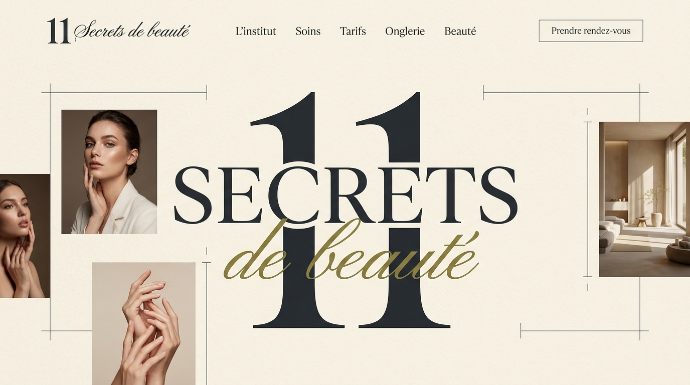
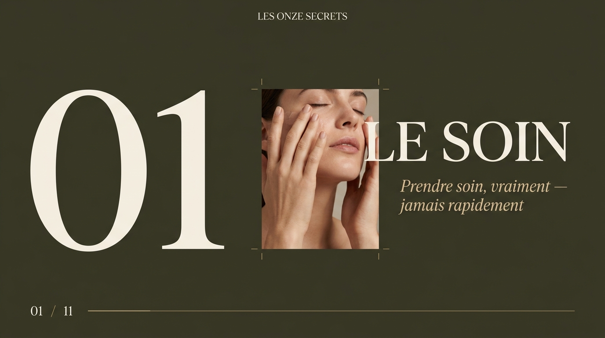
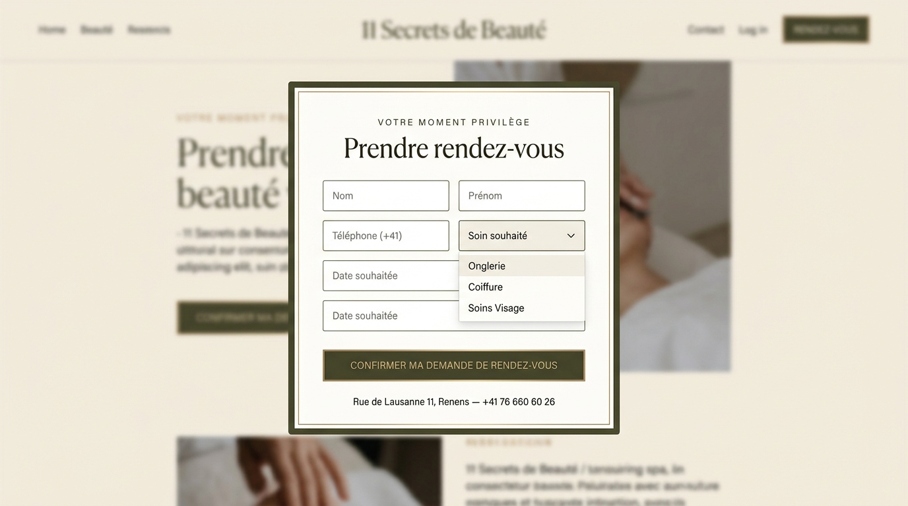
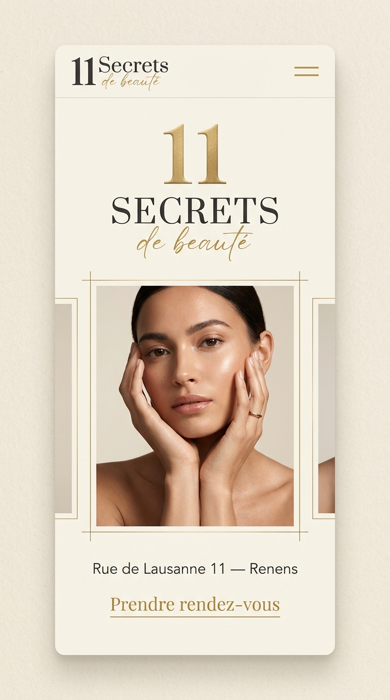

# 11 Secrets de Beauté ✨
> **Institut de Beauté d'Exception & Haute Cosmétique — Genève / Suisse Romande**
>
> Une vitrine digitale au design éditorial *Haute Couture*, alliant raffinement visuel, typographie d'art et expérience interactive fluide.

---

## 📸 Aperçu & Direction Artistique

| Page d'Accueil & Univers Éditorial | Les 11 Secrets & Philosophie |
| :---: | :---: |
|  |  |

| Modale Interactive de Réservation | Expérience Mobile & Responsive |
| :---: | :---: |
|  |  |

---

## 🌸 L'Univers 11 Secrets de Beauté

Situé au cœur de la Suisse romande, **11 Secrets de Beauté** propose une approche holistique et personnalisée du soin et du bien-être :

* **Soins du Visage & Rituels Anti-Âge** : Diagnostics pointus et protocoles d'exception avec nos partenaires cosmétiques de prestige (*Contrage*, *Ella Baché*).
* **Soins du Corps & Massages Signatures** : Massages relaxants, gommages régénérants, drainages et rituels signature.
* **Haute Onglerie & Beauté des Mains/Pieds** : Manucure russe de précision, poses gel et chablon haute tenue, vernis semi-permanent haut de gamme (*Kiara Sky*).
* **Haute Coiffure & Soins Profonds** : Diagnostic capillaire, rituels botox capillaire (*Ybera Paris*), lissages d'excellence, coupes et colorations sur-mesure.
* **Regard & Rituels Précision** : Restructuration des sourcils, rehaussement de cils et épilations délicates.

---

## 💎 Direction Artistique & Expérience Utilisateur

Le projet a été entièrement repensé autour d'une direction artistique digne des maisons de luxe et des magazines de mode :

* **Palette Chromatique Prisée** : Noir profond (`#0c0b09`), albâtre chaud, or champagne (`#d4af37`, `#b89047`) et touches subtiles nude poudré.
* **Typographie Éditoriale d'Art** : Harmonie entre des polices serif sophistiquées (*Cormorant Garamond*, *Playfair Display*) et sans-serif géométriques (*Montserrat*, *Cinzel*).
* **Micro-Interactions & Finitions Haut de Gamme** :
  * Curseur personnalisé interactif sur desktop avec effet d'aimantation visuelle.
  * Cadres déstructurés dynamiques (*open frames* `.oframe`) apportant du relief aux visuels.
  * Défilement ultra-fluide avec prise en charge native ou accélérée (*Lenis Smooth Scroll*).
  * Menu plein écran immersif avec animations architecturales.
  * Modale de réservation interactive connectée avec calcul des prestations en CHF et pré-remplissage.

---

## 🛠️ Stack Technique & Architecture

Construit dans le respect des standards web modernes, sans dépendance lourde ni framework monolithique :

* **HTML5 Sémantique & SEO** :
  * Balisage sémantique rigoureux (`<header>`, `<nav>`, `<main>`, `<section>`, `<article>`, `<footer>`).
  * Métadonnées Open Graph, Twitter Cards et hiérarchie de titres stricte.
* **Vanilla CSS3 de Haute Précision** :
  * `styles/editorial.css` : Système de style éditorial unifié pour l'ensemble des pages (grilles asymétriques, typographie, boutons prestige, transitions).
  * `styles/variables.css` : Tokens de design (couleurs, ombres douces, gradients champagne, transitions).
  * `styles/base.css` & `styles/components.css` : Structure de base, boutons, cartes et formulaires.
  * `styles/responsive.css` : Adaptation minutieuse pour smartphones, tablettes et écrans haute résolution.
* **JavaScript ES Modules (Vanilla JS)** :
  * `js/editorial.js` : Moteur universel d'interaction (curseur, menu plein écran, cadres `.oframe`, intégration du défilement doux et ouverture modale).
  * `js/components/booking-modal.js` : Modale de prise de rendez-vous multi-étapes avec validation en temps réel.
  * `js/data/` : Sources de vérité modulaires pour les prestations, tarifs officiels (en Francs Suisses - CHF), marques et informations de contact.

---

## 📂 Structure du Répertoire

```
11-secrets-de-beaute/
├── contact.html                  # Coordonnées, horaires, carte d'accès et formulaire
├── index.html                    # Page d'accueil éditoriale, hero & présentation des 11 secrets
├── institut.html                 # Philosophie, charte d'excellence et univers de l'institut
├── marques.html                  # Maisons partenaires d'exception (Ella Baché, Contrage, etc.)
├── onglerie.html                 # Espace dédié à la haute onglerie et manucure russe
├── partenariat.html              # Espace partenaires, opportunités professionnelles & collaborations
├── soins.html                    # Menu complet des rituels visage, corps et bien-être
├── tarifs.html                   # Grille tarifaire détaillée et interactive (CHF)
├── server.ps1                    # Serveur HTTP local prêt à l'emploi (PowerShell)
├── js/
│   ├── components/
│   │   ├── booking-modal.js      # Modale de réservation interactive multi-étapes
│   │   ├── footer.js             # Composant de pied de page réutilisable
│   │   └── header.js             # En-tête et barre de navigation dynamique
│   ├── data/
│   │   ├── marques-data.js       # Données sur les marques partenaires
│   │   ├── salon.js              # Données de l'institut (adresses, horaires, contacts)
│   │   ├── soins-data.js         # Données des soins et rituels
│   │   └── tarifs-data.js        # Données de la carte tarifaire (CHF)
│   ├── editorial.js              # Moteur d'interaction universel (Lenis, menu, curseur, modal)
│   └── main.js                   # Point d'entrée applicatif standard
├── styles/
│   ├── base.css                  # Réinitialisation moderne et fondations
│   ├── components.css            # Styles des composants d'interface
│   ├── editorial.css             # Design system Haute Couture unifié
│   ├── responsive.css            # Règles adaptatives mobiles et tablettes
│   └── variables.css             # Tokens CSS (couleurs or, typographie, espacements)
└── public/
    ├── images/
    │   ├── logo/                 # Logotype officiel de la maison
    │   ├── marques/              # Logos et visuels des marques de cosmétique
    │   ├── salon/                # Photographies haute définition des espaces de l'institut
    │   └── soins/                # Photographies des rituels et prestations
    └── presentation/             # Captures haute résolution et maquettes éditoriales
```

---

## 🚀 Lancement Local

### Option 1 : Serveur PowerShell intégré (Recommandé sous Windows)
Un serveur HTTP local est directement inclus à la racine du projet :
```powershell
powershell -ExecutionPolicy Bypass -File .\server.ps1
```
Le site sera immédiatement accessible sur :  
👉 **http://localhost:8080**

### Option 2 : Tout serveur HTTP statique
Vous pouvez lancer le projet avec n'importe quel outil statique :
```bash
# Avec npx serve
npx -y serve .

# Ou avec Python
python -m http.server 8080
```

---

## 📍 Contact & Informations Officielles

* **Maison** : 11 Secrets de Beauté
* **Localisation** : Genève / Suisse romande
* **Monnaie** : Franc Suisse (CHF)
* **Site de référence** : [11secretsdebeaute.ch](https://11secretsdebeaute.ch/)
